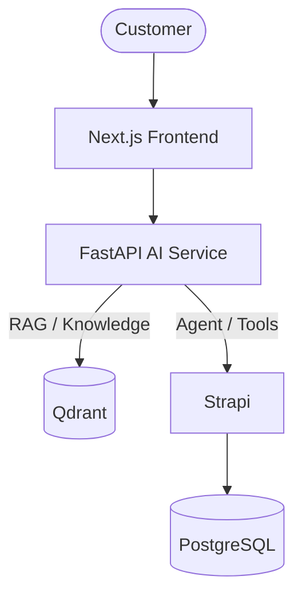
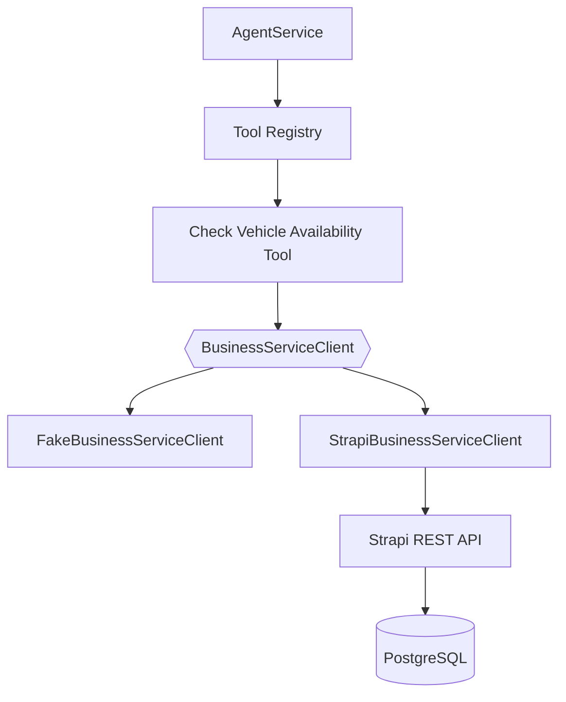
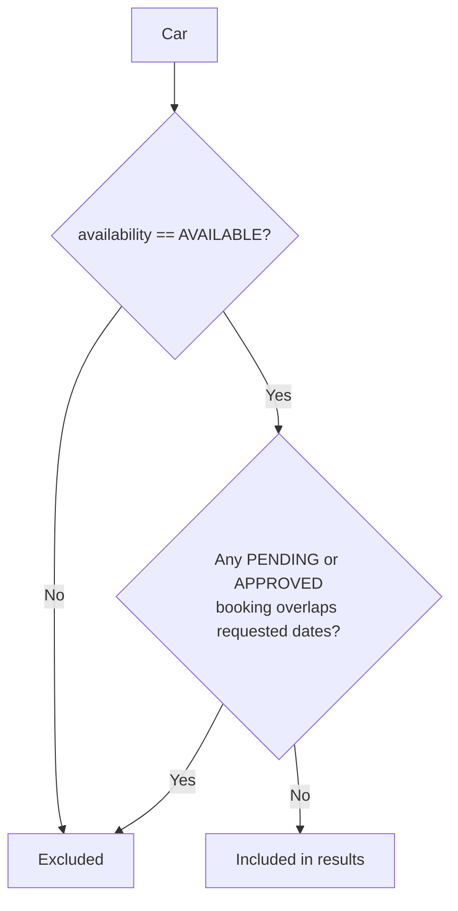
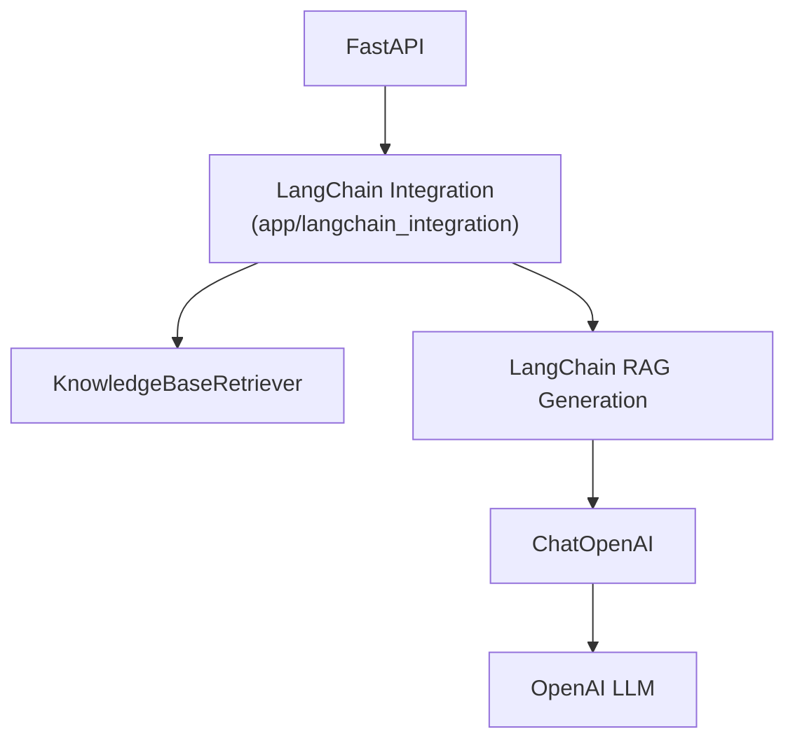
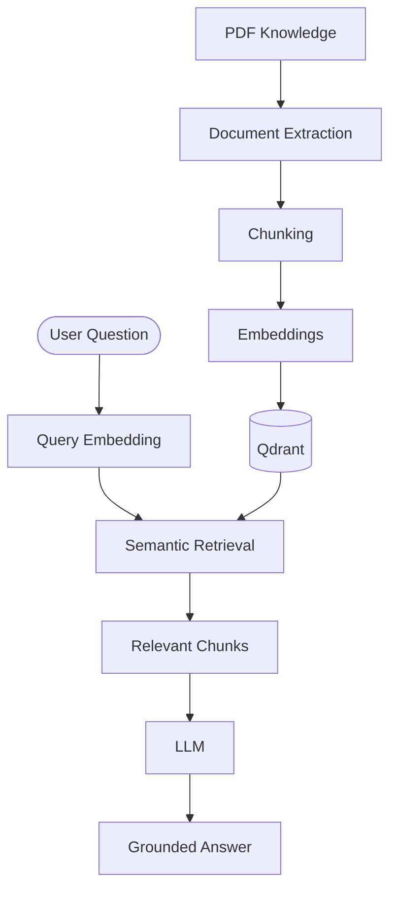
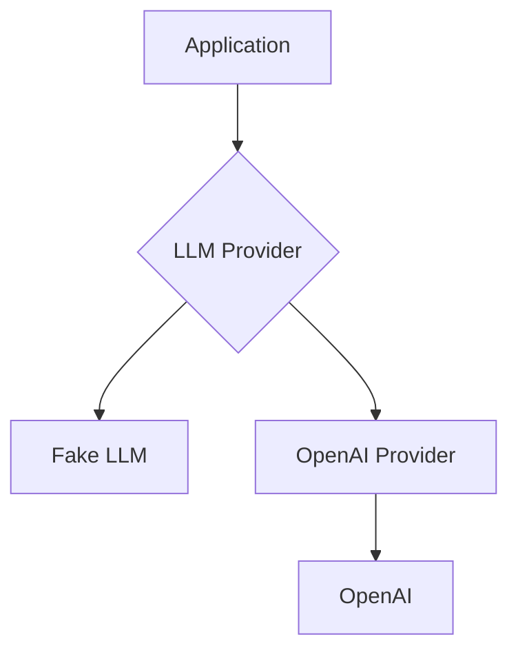
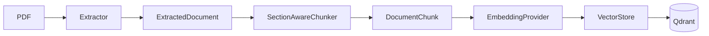
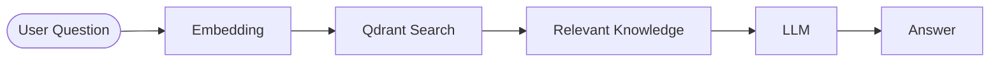
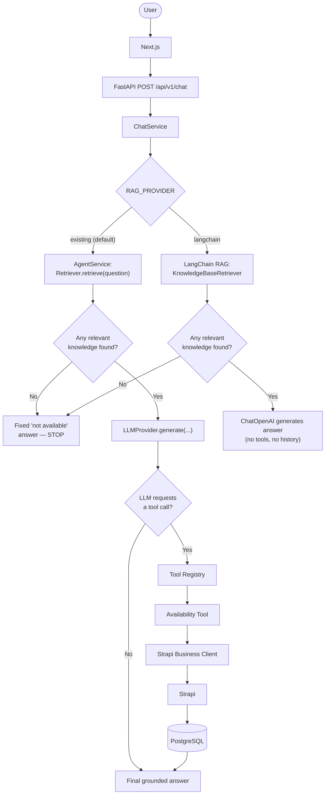

# Agentive AI Service

The Python/FastAPI AI service for the Agentive Car Rental platform. It owns everything
AI-specific — LLM interaction, knowledge retrieval (RAG), and agent/tool orchestration — kept
separate from Strapi, which owns the business data (Cars, Bookings, Payments).

This README is an architecture map: diagrams first, short explanations second. For narrative
step-by-step history, see git log; this document only describes what exists **today**.

---

## 1. Agentive Architecture



| System | Role |
|---|---|
| **Next.js** | Customer-facing chat UI. Calls this FastAPI service directly (`NEXT_PUBLIC_API_URL`, proxied same-origin). |
| **FastAPI** | The AI/agent service — this repository. Answers chat questions using RAG, and can call business tools. |
| **Qdrant** | Semantic knowledge/vector store — policy documents, chunked and embedded. |
| **Strapi** | Business/admin backend — Cars, Bookings, Payments, managed by the operations team. |
| **PostgreSQL** | Transactional business data, owned by Strapi. |

> **Important distinction**
> - **Qdrant = what the Agent *knows*** (static policy/knowledge documents).
> - **PostgreSQL (via Strapi) = what the business *has right now*** (live cars, bookings, payments).
>
> Qdrant is never the source of truth for live availability or bookings — that's always a real-time call to Strapi, described in §2.

`agentive-service` (the NestJS project) and `agentive-py-service` (this repository) are separate
codebases in this workspace. The Next.js frontend calls **this** service directly — NestJS is
not currently in the live chat request path.

---

## 2. Strapi + Business Tools



- Strapi manages **Cars**, **Bookings**, and **Payments** (see `admin/` for the Strapi project).
- The one implemented business tool today is **`check_vehicle_availability`**. No booking or
  payment tool exists yet.
- `StrapiBusinessServiceClient` is the real HTTP implementation (`GET /api/cars?populate=bookings`,
  Bearer token auth). `FakeBusinessServiceClient` is a deterministic test double — selected via
  `BUSINESS_SERVICE_PROVIDER=fake` (default) or `strapi`.

**Availability logic** (`app/tools/availability_rules.py`) — evaluated per car:



- Only `PENDING` and `APPROVED` bookings block a date range. `DECLINED`, `CANCELLED`, and
  `COMPLETED` never block, at any date.
- Date overlap: `pickupDate <= requestedEnd AND returnDate >= requestedStart` — **inclusive**
  boundaries (a same-day touch counts as a conflict).
- `category` filters by `Car.type`, case-insensitively. There is no filter by `vehicle_id` or
  `model`.

---

## 3. LangChain



- LangChain is an **integration/orchestration layer**, isolated to `app/langchain_integration/`
  — no other module imports it.
- It currently provides two things: **`KnowledgeBaseRetriever`** (wraps this project's existing
  `Retriever`/Qdrant, translated into LangChain `Document` objects) and **`LangChainRagGenerationService`**
  (retrieval + `ChatOpenAI` prompt → grounded answer). Selected via `RAG_PROVIDER=langchain`.
- This project's own provider abstractions (`LLMProvider`, `EmbeddingProvider`, `VectorStore`)
  remain in place and are **not** replaced by LangChain — the default chat path
  (`RAG_PROVIDER=existing`) still uses them directly, unchanged.
- **The LangChain path has no tool-calling and does not forward conversation history.** It cannot
  reach the Strapi business tool from §2 — only the default `AgentService` path (§7) can.

> ⚠️ **FUTURE / NOT IMPLEMENTED — LangGraph.** No LangGraph code, dependency, or conversation
> graph exists anywhere in this codebase today. Any multi-step booking-flow graph is a future
> phase.

---

## 4. RAG



**The six canonical knowledge documents** (`data/knowledge/`):

| File | Title |
|---|---|
| `01-rental-services.pdf` | Rental Services |
| `02-rental-policies.pdf` | Rental Policies |
| `03-booking-policy.pdf` | Booking Policy |
| `04-cancellation-policy.pdf` | Cancellation Policy |
| `05-payment-policy.pdf` | Payment Policy |
| `06-pickup-return-policy.pdf` | Pickup and Return Policy |

- If no relevant chunk is found, the system returns a fixed "not available in the knowledge
  base" answer instead of calling the LLM with no context — it never guesses.
- With the default local config (`VECTOR_STORE_PROVIDER=memory`), these six PDFs are
  auto-ingested into an in-memory store at FastAPI startup. Ingesting into Qdrant is a separate,
  explicit step (§6) — not automatic.

---

## 5. LLM



- The **LLM** generates the natural-language answer (`LLM_PROVIDER=fake` default, or `openai`).
- **Embedding generation is a separate concern** (`EmbeddingProvider`, `EMBEDDING_PROVIDER=fake`
  default, or `openai`) — a different setting, a different model, used to turn text into vectors
  for retrieval, not to write answers.
- The real embedding model used for the knowledge base is **`text-embedding-3-small`**
  (`OPENAI_EMBEDDING_MODEL`).
- Both are selected behind Protocols (`LLMProvider`, `EmbeddingProvider`) so a fake, deterministic
  implementation backs the whole test suite with no network access, while `openai` is a drop-in
  swap for real answers/embeddings — no other layer changes.

---

## 6. Data Pipeline

**Ingestion** (build-time / explicit, not automatic against Qdrant):



Run via `python -m app.knowledge.ingest` (Qdrant only; the default in-memory store bootstraps
automatically at startup instead — see §4).

**Runtime query path** (every `/api/v1/chat` request) — a **separate flow**, read-only against
whatever ingestion already produced:



Ingestion writes to Qdrant; retrieval only reads from it. Nothing in the chat request path ever
re-embeds or re-ingests a document.

---

## 7. Chat / Agent Runtime Flow



**Two independent paths, selected by `RAG_PROVIDER`** — only the default (`existing`,
`AgentService`) path can reach tools/Strapi at all; the `langchain` path never offers tools.

**The retrieval gate is real and matters, on both paths**: knowledge base retrieval is checked
*before* generation. If retrieval finds nothing for the question, the request stops with a
fixed "not available" answer — on the `existing` path, tool-calling (and therefore Strapi) is
never reached for that request.

> **Status, stated precisely:**
> - ✅ `StrapiBusinessServiceClient` is implemented and tested against a real, running Strapi
>   instance (4/4 integration tests passing).
> - ✅ The code path `ChatService → AgentService → ToolRegistry → Tool → BusinessServiceClient`
>   is wired and reachable via configuration (`BUSINESS_SERVICE_PROVIDER=strapi`).
> - ❌ **Not yet proven**: real OpenAI (deciding, on its own, to call the tool) + real Strapi, in
>   one single end-to-end chat request. Each half is tested separately, with a fake standing in
>   for the other half every time. Do not treat this combined flow as working until it has an
>   end-to-end test or a manual run backing that claim.

---

## 8. Project Structure

```
app/
├── chats/                  # POST /api/v1/chat — router, schemas, ChatService
├── agent/                  # AgentService — retrieval + bounded tool-calling + LLM
├── rag/                    # AnswerGenerator — plain RAG (retrieval + LLM), no tools
├── llm/                    # LLMProvider Protocol — fake / OpenAI implementations
├── knowledge/               # Extraction, chunking, embedding, vector store, retrieval, ingestion
├── tools/                  # Tool/ToolRegistry, BusinessServiceClient, availability tool
├── langchain_integration/  # Sole isolation boundary for the langchain SDKs
├── conversation/           # Conversation/ConversationMessage, ConversationStore (in-memory)
├── core/                   # Settings (env/config)
├── api/                    # Router aggregation + shared exception handlers
└── health/                 # Health-check endpoint

tests/          # Mirrors app/ — one test package per feature
data/knowledge/ # The six canonical PDFs (see §4)
admin/          # Strapi business backend (separate project, see admin/README or Phase 1 notes)
```

---

## 9. Current Status

| Component | Status |
|---|---|
| Next.js Chat UI | ✅ Implemented |
| FastAPI Chat API (`POST /api/v1/chat`) | ✅ Implemented |
| RAG (`AnswerGenerator`, default path) | ✅ Implemented |
| Qdrant vector store | ✅ Implemented (opt-in: `VECTOR_STORE_PROVIDER=qdrant`; default is in-memory) |
| LangChain retriever + RAG generation | ✅ Implemented (opt-in: `RAG_PROVIDER=langchain`; no tool-calling) |
| Conversation memory (multi-turn) | ✅ Implemented (in-memory, single process only) |
| Strapi Business Client | ✅ Implemented, tested against real Strapi |
| Vehicle Availability Tool | ✅ Implemented, wired into `AgentService` |
| Booking Tool | ❌ Not implemented |
| Payment Tool | ❌ Not implemented |
| LangGraph | ❌ Not implemented |
| Real full E2E: Agent → OpenAI → Tool → Strapi | ⚠️ Not yet proven together |
| PostgreSQL-backed conversation persistence | ❌ Not implemented |
| Multiple tool-call rounds / multiple tools | ❌ Not implemented (bounded to exactly one round, one tool) |

---

## Getting Started

```bash
python3 -m venv .venv && source .venv/bin/activate
pip install -e ".[dev]"
cp .env.example .env   # fill in as needed
fastapi dev app/main.py
python -m pytest -v
```

Key settings (`.env` — see `.env.example` for the full, commented list):

| Variable | Purpose |
|---|---|
| `LLM_PROVIDER` | `fake` (default) or `openai` |
| `EMBEDDING_PROVIDER` | `fake` (default) or `openai` — independent of `LLM_PROVIDER` |
| `VECTOR_STORE_PROVIDER` | `memory` (default), `pgvector`, or `qdrant` |
| `RAG_PROVIDER` | `existing` (default, `AgentService`) or `langchain` |
| `BUSINESS_SERVICE_PROVIDER` | `fake` (default) or `strapi` |
| `STRAPI_URL` / `STRAPI_API_TOKEN` | Required only when `BUSINESS_SERVICE_PROVIDER=strapi` |

`.env` is gitignored and must never be committed — only `.env.example`, with placeholders.

---

## Engineering Principles

- **Provider boundaries** — every external system (OpenAI SDK, Qdrant client, LangChain, Strapi)
  sits behind a Protocol this application defines, never imported outside its own module.
- **Fakes for everything real** — every provider has a deterministic fake/mock counterpart, so
  the full test suite runs with no network access and no API keys by default.
- **Separate domains stay separate** — knowledge (facts, embeddings), conversation (dialogue
  history), and tools (live business operations) share no model, table, or store.
- **Integration boundaries own no business data** — `app/tools` describes and invokes business
  operations; Strapi/PostgreSQL remains the sole source of truth for Cars/Bookings/Payments.
- **Incremental, not speculative** — a capability is built when a real consumer needs it, not
  ahead of time (e.g. no booking tool exists because nothing calls it yet).
